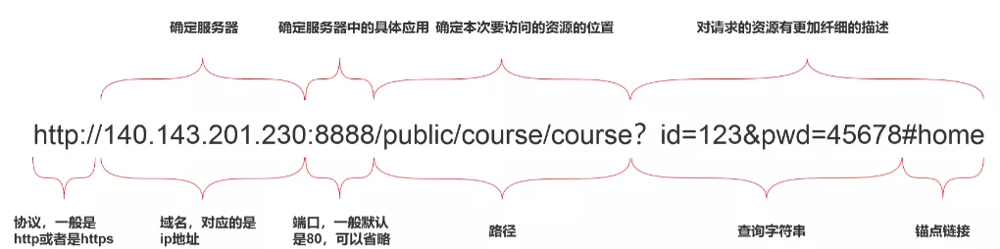
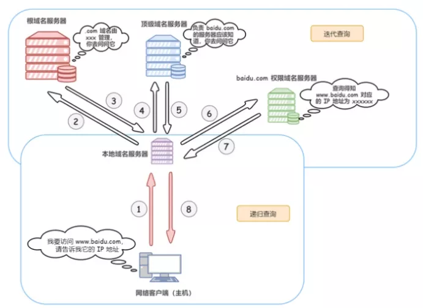
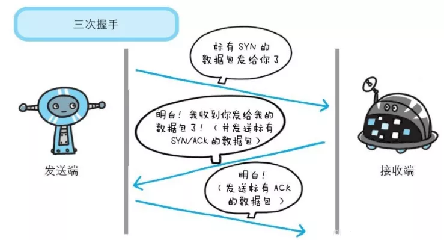
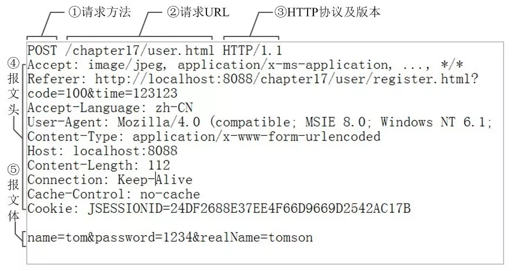
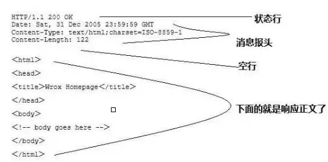
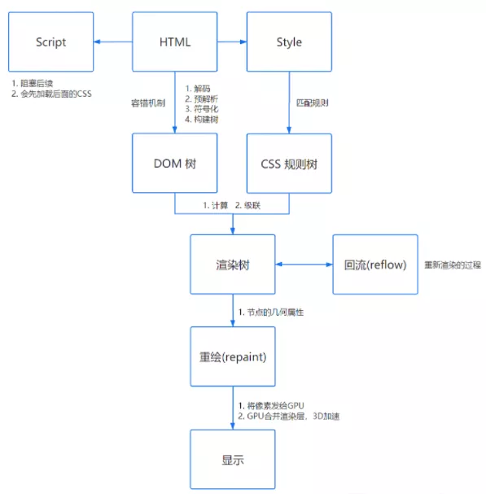
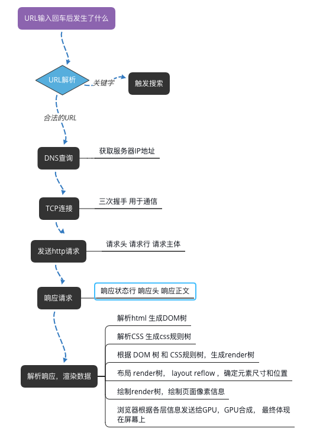

# 地址栏输入 URL 敲下回车后发生了什么

- [说说地址栏输入 URL 敲下回车后发生了什么](https://mp.weixin.qq.com/s/Ql1tD-YJSVXb-wK5t2iIWw)

## 整体流程

- URL 解析

- DNS 查询

- TCP 连接

- HTTP 请求

- 响应请求

- 页面渲染

## URL 解析

- 首先判断是否是合法的 URL ，还是 搜索的关键字 ，然后根据输入做响应的操作

- URL 的结构解析如下

> 协议（http/https） + 域名（确定服务器） + 端口（确定服务器中的具体应用） + 路径（确定本次访问资源的位置） + 查询条件 + 锚点

## DNS 查询

- 获取域名对应的服务器IP地址

## TCP 连接

- 三次握手 建立 TCP 连接 

## 发送 http 请求 

- 建立TCP连接后，浏览器和服务器就可以通信了，浏览器发送http请求到服务器  
  请求的内容包括：请求行 请求头 请求主体

## 响应请求

- 当服务器接收到请求后， 会进行一些逻辑处理，然后返回 HTTP 响应消息，  
  消息包括： 状态行  响应头  响应正文

- 在服务器响应之后， 由于现在 http 默认开始长连接 keep-alive ，当页面关闭后，tcp 连接将会通过四次挥手断开连接

## 页面渲染

当浏览器接收到服务器响应的返回后，将解析资源：  

- 查看响应头信息，根据不同指示做对应处理，比如 存储cookie 重定向 缓存资源等等 

- 查看响应头的 Content-Type 值，根据不同类型做不同解析

页面渲染过程

- 解析 HTML 生成 DOM 树

- 解析 Css 生成css规则树

- 合并 DOM 和 CSS 规则，生成 render 树

- 布局 render 树（layout reflow），负责元素尺寸和位置的计算

- 绘制 render 树（paint） ，绘制页面像素信息

- 浏览器会根据各层信息发送给 GPU ，GPU合成，然后显示在屏幕上

