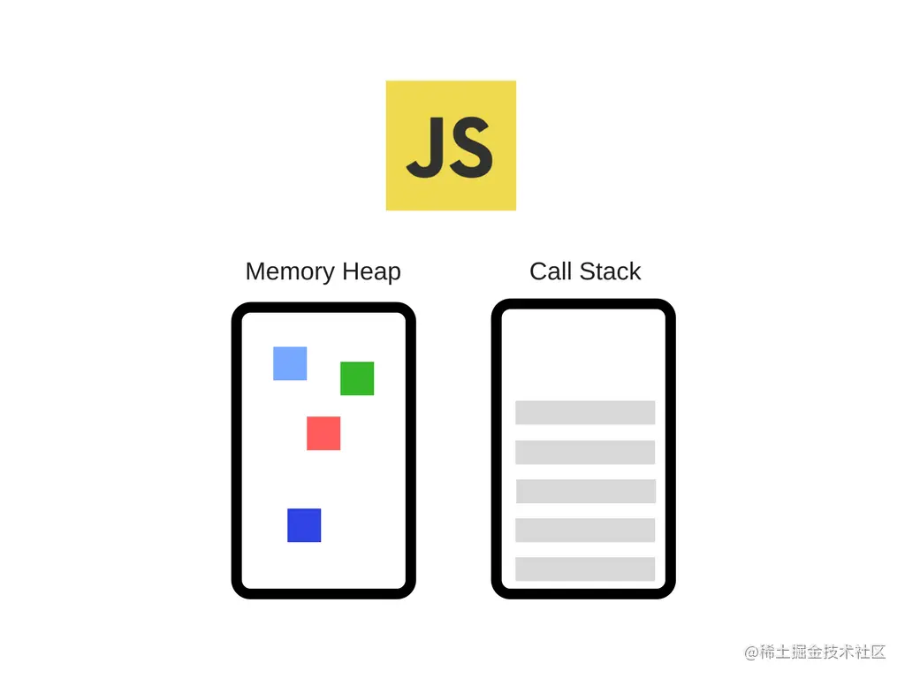
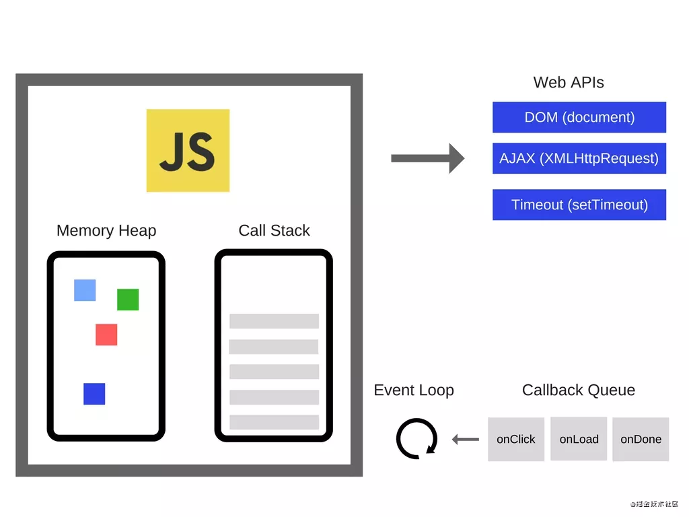
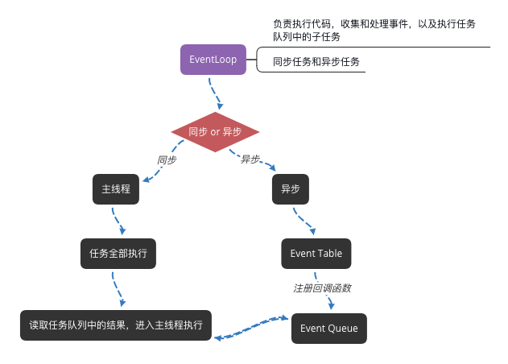
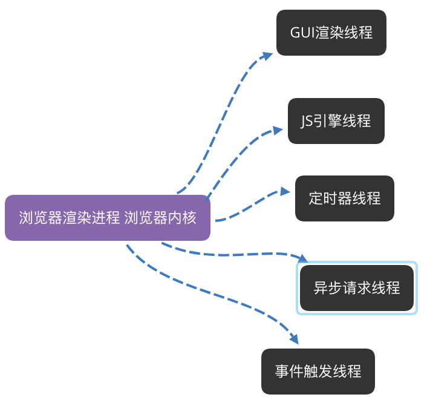
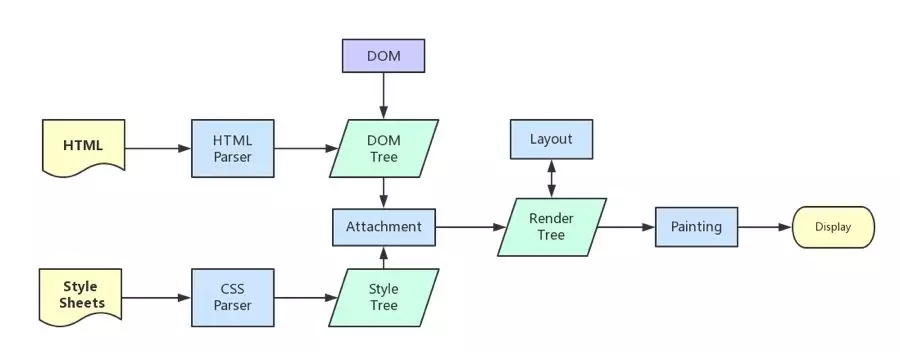

# EventLoop

- [如何理解单线程的JavaScript及其工作原理](https://mp.weixin.qq.com/s/omqXH1SxJyvl7N8y-6Zp3Q)

- [从浏览器多进程到JS单线程，JS运行机制最全面的一次梳理](https://mp.weixin.qq.com/s?__biz=MjM5MTA1MjAxMQ==&mid=2651228065&idx=2&sn=0db2e69aa9344d4b086e9d98301aebad&scene=21#wechat_redirect)

- [说说你对JavaScript中事件循环的理解​](https://mp.weixin.qq.com/s/9iN7XR1PwXfua8SrabOi5w)

## 为什么JavaScript是单线程

* 作为浏览器脚本语言，JavaScript 的主要用途是与用户互动，以及操作DOM。
  这决定了它只能是单线程，否则会带来很复杂的同步问题。比如，如果是多线程，一个线程添加DOM，另一个删除DOM，
  浏览器将不知如何处理

- 如果是多线程 会存在线程间的同步问题，比如当页面更新内容时，用户又触发了交互，这时线程间的同步会变得很复杂

## JavaScript 引擎

- 引擎包括两个组件

1. 内存堆 - 进行内存分配的区域
2. 调用栈 - 代码执行时栈中的位置



## 调用栈

- 因为JavaScript是单线程，所以只有一个调用栈，一次只能做一件事。

- 调用栈是一种数据结构，当执行一个函数时，会将其置于栈的底部，执行完成后，将其从底部移除。

## 事件循环

- 负责执行代码，收集和处理事件，以及执行任务队列中的子任务





- Javascript 有一个主线程和执行栈，所有的任务都会被放到调用栈等待主线程执行

- 同步任务会被放在调用栈中，按照顺序等待主线程依次执行

- 主线程之外存在一个任务队列(由[事件触发线程管理](#事件触发线程))，所有任务在主线程中以执行栈的方式运行

- 同步任务都在主线程上执行，栈中代码在执行的时候会调用 Web API，此时会产生一些异步任务

- 异步任务会在有了结果（比如被监听的事件发生时）后，将注册的回调函数放入任务队列中

- 执行栈中任务执行完毕后，此时主线程处于空闲状态，会从任务队列中获取任务进行处理

以上过程会不断重复，这就是浏览器的运行机制，也是Event Loop。

**以上ES5情况，下面ES6情况**，运行机制

- 执行一个宏任务（栈中没有就从事件队列中获取）

- 执行过程中如果遇到微任务，就将它添加到微任务的任务队列中

- 宏任务执行完毕后，立即执行当前微任务队列中的所有微任务（依次执行）

- 当前宏任务执行完毕，开始检查渲染，然后`GUI线程`接管渲染

- 渲染完毕后，JS线程继续接管，开始下一个宏任务（从事件队列中获取）

## 任务队列 同步任务和异步任务

* 同步任务，在主线程上排队执行的任务，只有前一个任务执行完毕，才执行下一个任务。

* 异步任务，不进入主线程，而进入任务队列的任务，只有任务队列通知主线程，某个任务可以执行了，
  该任务才进入主线程执行。

* 只要主线程空了，就会去读取"任务队列"，这就是JavaScript的运行机制。这个过程会不断重复。

* 任务队列是一个事件的队列，IO设备完成一项任务，就在任务队列中添加一个事件，表示相关的异步任务
  可以进入执行栈了。主线程读取任务队列，就是读取里面有哪些事件。异步任务必须指定回调函数，当主线程开始
  执行异步任务，其实就是执行对应的回调函数。

## 异步任务分为宏任务和微任务

### 微任务

- 一个需要异步执行的函数，执行时机在主函数执行结束之后，当前宏任务结束之前。  
  或者说 当前宏任务执行完后立即执行的任务

- 响应速度比 setTimeout 更快，无需等渲染

- 在某一个macrotask执行完后，就会将在它执行期间产生的所有microtask都执行完毕（在渲染前）

- 常见的微任务：
1. Promise().then()
2. MutaionObserver 
3. process.nextTick（Node.js）

### 宏任务
1. script
2. setTimeout/setInterval

```js
// js 任务队列
var a6 = 6;
setTimeout(() => {
  a6 = 666;
}, 0);
new Promise((res, req) => {
  console.log();
  
})
console.log(a6); // 6

// 整个主任务是一个宏任务
// setTimeout  新的宏任务 下一个循环执行
setTimeout(() => {
  console.log('setTimeout');
}, 0);

let promise =  new Promise((resovle, req) => {
  // Promise 主流程 直接处理
  console.log('Promise 00');
  resovle()
})
// Promise 异步 微任务 放入微任务队列 后面执行
promise.then(() => {
  console.log('Promise 11');
})
// 主流程 直接处理
console.log('normal');
// 到此宏任务执行完毕，然后去微任务队列检查有没有微任务，发现 Promise().then() ，执行，
// 之后，新一轮开始执行宏任务，找到 setTimeout()，执行

// 顺序
// Promise 00
// normal
// Promise 11
// setTimeout
```

## await async
### async 
* 返回一个Promise对象
```js
function f() {
  return Promise.resolve('TEST');
}

// asyncF is equivalent to f!
async function asyncF() {
  return 'TEST';
}
```

### await
* 正常情况 await后面是一个Promise对象，返回该对象的结果，如果不是Promise对象，则返回对应值
```js
async function af() {
  return 123;
}
await af() // 123
```
* 不管await后面跟什么，都会被堵塞
```js
async function f1() {
  console.log(1);
  await f2();
  console.log(3);
}

async function f2() {
  console.log(2);
}

f1();
console.log(4);
// 1 2 4 3
```

## 进程和线程 

- 进程是一个工厂

- 工厂有它独立的资源（系统分配的内存）

- 工厂之间相互独立（进程之间相互独立）

- 线程是工厂的工人（可以存在一个或多个）

- 多个工人协作完成任务（多个线程在进程中协作工作）

- 工人之间共享空间（统一进程下的线程之间共享内存空间）

## 浏览器是多进程的 包含哪些进程

- Browser 进程，浏览器的主线程，只有一个，主要负责协调主控

> 负责浏览器界面显示，与用户交互。如前进，后退等  
  负责各个页面的管理，创建和销毁其他进程  
  将Renderer进程得到的内存中的Bitmap，绘制到用户界面上  
  网络资源的管理，下载等

- 第三方插件进程，每种类型的插件对应一个进程，且只有使用该插件时才创建

- GPU 进程，只有一个，用于 3D 绘制等

- 浏览器渲染进程（浏览器内核， Render进程，内部是多线程的），默认每个tab也一个进程，互不影响。
  主要用于页面渲染，脚本执行，事件处理等

## 浏览器渲染进程 包含哪些线程

### GUI 渲染线程 

- 负责渲染浏览器界面，解析HTML， CSS，构建DOM树，和 RenderObject 树，布局和绘制等

- 当页面需要重绘和回流时，该线程会被执行

- 注意 **GUI渲染线程和JS引擎线程是互斥的** ，当JS引擎执行时，GUI会被挂起，GUI更新会保存在一个队列中，等JS引擎空闲时立即被执行

### JS引擎线程

- 也称为`JS内核`，负责处理Js脚本程序（如 V8 引擎）

- 负责解析 JS 脚本，运行代码

- 一直等待任务队列中的任务到来，然后执行

- 注意 **GUI渲染线程和JS引擎线程是互斥的** ，所以如果JS执行的时间过长，会导致页面的渲染不连续，导致页面渲染加载堵塞

### 事件触发线程

- 归属于浏览器而不是JS引擎，用来控制事件循环（JS引擎忙不过来，需要浏览器另开线程协助）

- 当 `JS引擎` 执行代码块如 setTimeout 点击事件 Ajax 异步请求 时，会将对应的任务添加到事件线程中

- 当对应的事件符合触发条件时，该线程会把事件添加到待处理任务队列的队尾，等待 `JS引擎` 处理

- 注意，由于 JS 单线程的关系，所以这些任务队列的事件会等到 `JS引擎` 空闲时才会被执行

### 定时触发器线程

- setInterval setTimeout 所在线程

- 浏览器定时计数器并不是在 `JS引擎` 计数的，因为 js单线程，如果遇到堵塞时会影响计数的准确性，
  因此通过单独线程来计时，和触发定时，计时完毕后，添加到事件队列中，等待 `JS引擎` 调用

- 注意，W3C在HTML标准中规定，规定要求setTimeout中低于4ms的时间间隔算为4ms

### 异步请求线程 

- 在 XMLHttpRequest 连接后，浏览器新建一个异步线程

- 当检测到状态变更时，如果设置了回调函数，则异步线程将事件放入事件队列中，等待 `JS引擎` 调用 



## 浏览器和线程之间的关系

### GUI渲染线程和JS引擎是互斥的

- 因为 js 是可以操作DOM的，如果在修改元素属性时渲染界面（JS引擎线程和GUI渲染线程同时执行），
  那么渲染线程前后获取的元素数据就不一致了，为了防止渲染时出现不可预期的结果，所以是互斥的。

### WebWorker ，JS的多线程？

- 创建 WebWorker 时，`JS引擎` 向`浏览器`申请的一个子线程，完全受主线程控制，不能操作DOM

- JS引擎线程与 worker 线程间通过特定的方式通信（postMessage API）

- JS引擎 依然是单线程的， WebWorker 是浏览器给 JS引擎 开的外挂，专门解决大计算量问题

### WebWorker与SharedWorker 

- WebWorker只属于某个页面，不会和其他页面的Render进程（浏览器内核进程）共享

- 所以Chrome在Render进程中（每一个Tab页就是一个render进程）创建一个新的线程来运行Worker中的JavaScript程序。

- SharedWorker是浏览器所有页面共享的，不能采用与Worker同样的方式实现，因为它不隶属于某个Render进程，
  可以为多个Render进程共享使用

- 所以Chrome浏览器为SharedWorker单独创建一个进程来运行JavaScript程序，
  在浏览器中每个相同的JavaScript只存在一个SharedWorker进程，不管它被创建多少次。

## 浏览器渲染过程

- 浏览器输入url，浏览器主进程接管，开一个下载线程，然后进行http请求（略去DNS查询，IP寻址等等操作），
  然后等待响应，获取内容，随后将内容通过RendererHost接口转交给Renderer进程-浏览器渲染流程开始

- 浏览器内核拿到内容后

1. 解析 HTML 构建 DOM 树
2. 解析 css 构建 render 树，将css解析成树形数据结构，然后结合DOM 形成 render 树
3. 布局 render 树（layout 、 reflow），负责各元素尺寸，位置的计算
4. 绘制 render 树 （paint）
5. 浏览器将各层的信息发给 GPU ，GPU合成，显示在屏幕上



## Css 加载会不会阻塞DOM渲染
> 头部引入css 的情况

- css 是由单独的下载线程异步下载的，不会阻塞DOM树解析

- 但会阻塞 render 树渲染
> 因为你加载css的时候，可能会修改下面DOM节点的样式，如果css加载不阻塞render树渲染的话，那么当css加载完之后，
  render树可能又得重新重绘或者回流了，这就造成了一些没有必要的损耗。
  所以干脆就先把DOM树的结构先解析完，把可以做的工作做完，然后等你css加载完之后，在根据最终的样式来渲染render树，
  这种做法性能方面确实会比较好一点。
