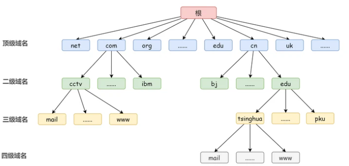
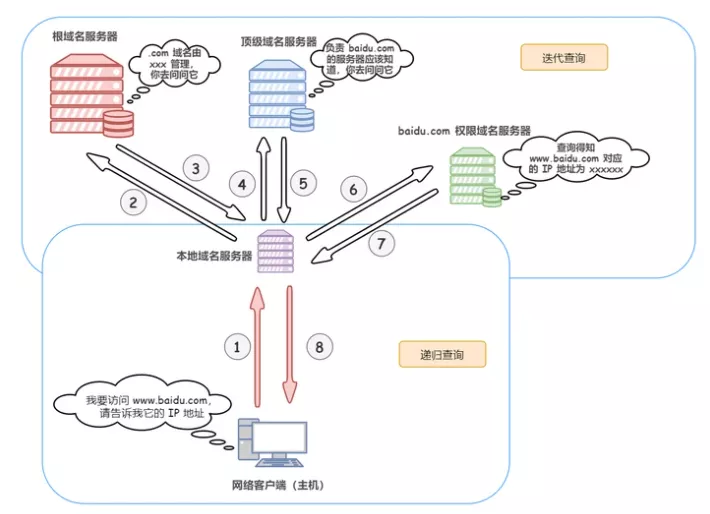

# DNS

- [参考](https://mp.weixin.qq.com/s/fdc-y_1pV67fU5dpuqC3ZQ)

- [DNS协议 是什么？说说DNS 完整的查询过程?](https://vue3js.cn/interview/http/DNS.html)

## 概念

- Domain Names System 域名系统，进行域名和与之对应的 IP 地址 转换的服务器

> 即相当于一个翻译官，负责将域名翻译成ip地址

## 域名

- 具有层次的结构，从上到下依次为根域名，顶级域名，二级域名，三级域名...

> 举例 www.xxx.com  
  www 为三级域名  
  xxx 二级域名  
  com 顶级域名

## 查询方式 

- 递归查询  
  如果 A 请求 B ，B作为请求的接收者一定要给A想要的答案  

- 迭代查询  
  如果接受者B 没有A所需要的准确内容，它将告诉 A 如何取得这个内容，但是 B 不会发出请求

## 域名缓存

- 在域名服务器解析的时候，使用缓存保存 域名和 IP 的映射关系

- 两种缓存方式  浏览器缓存 和 操作系统缓存

> 浏览器缓存：浏览器在获取域名对应的IP 后，会缓存，以减少网络请求的损耗  

> 操作系统缓存： 用户配置的 hosts 文件

## 查询过程 

1. 首先查询浏览器DNS缓存

2. 如果浏览器缓存没有，则查询操作系统缓存 

3. 如果操作系统没有，则操作系统将域名发送给本地域名服务器，本地域名服务器通过递归方式查询自己DNS缓存，查询成功则返回

4. 仍未查到，则本地域名服务器向上级域名服务器进行迭代查询

> 首先本地域名服务器向根域名服务器发起请求，根域名服务器返回顶级域名服务器的地址给本地服务器  
  本地域名服务器拿到这个顶级域名服务器的地址后，就向其发起请求，获取权限域名服务器的地址  
  本地域名服务器根据权限域名服务器的地址向其发起请求，最终得到该域名对应的 IP 地址  

5. 本地域名服务器得到 IP 地址，返回操作系统，并缓存映射关系

6. 操作系统将 IP 返回浏览器，并缓存映射关系

7. 浏览器得到对应的 IP 地址，并缓存映射关系

