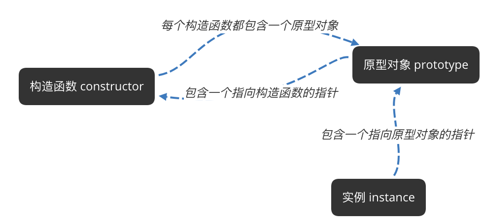
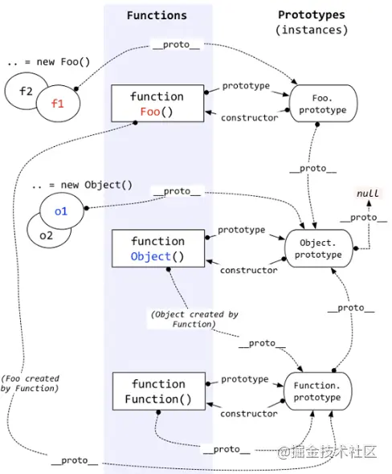

# 原型(链)

- [参考1](https://juejin.im/post/5c72a1766fb9a049ea3993e6)

- [参考2](https://juejin.cn/post/6844903475021627400)

## 原型的概念

- js 通过构造函数创建一个对象，每个构造函数内部都有一个 prototype 属性，这个属性是一个对象，
这个对象包含了可以由该构造函数的所有实例共享的属性和方法。当通过构造函数创建一个对象后， 该对象内部有一个指针(__proto__)
指向构造函数的 prototype 属性

## 构造函数 原型对象 实例 之间的关系 



## JS对象规则 原型链

- 如果试图引用对象（实例instance）的某个属性，首先会在对象内部寻找该属性，找不到才会到对象的原型（instance.prototype）上寻找，这个原型对象也有自己的原型，依次类推，这种搜索的轨迹，形似一条长链，又因为 原型（prototype）在这个规则中充当链接的作用，
于是把这种原型与原型的链条称为`原型链`

- 使用了原型链后, 当查找一个对象的属性时，JavaScript 会向上遍历原型链，直到找到给定名称的属性为止，到查找到达原型链的顶部，也就是 Object.prototype， 但是仍然没有找到指定的属性，就会返回 undefined. 此时若想避免原型链查找, 建议使用 **hasOwnProperty** 方法. 因为 **hasOwnProperty** 是 JavaScript 中唯一一个处理属性但是不查找原型链的函数. 如:  

`console.log(instance1.hasOwnProperty('age'));//true`  

## 原型链的问题

- 当原型链中包含引用类型值的原型时，该引用类型的值会被所有实例共享

- 在创建子类型（Son）时 不能向超类型（Father）的构造函数传递参数

## 解决原型链的问题 

- [继承方法](./几种继承的方法.md)

## 实例 

```js
var A = function() {};
A.prototype.n = 1;
var b = new A();
A.prototype = {
  n: 2,
  m: 3
}
var c = new A();

console.log(b.n); // 1
console.log(b.m); // undefined

console.log(c.n); // 2
console.log(c.m); // 3
```
----
```js
var F = function() {};

Object.prototype.a = function() {
  console.log('a');
};

Function.prototype.b = function() {
  console.log('b');
}

var f = new F();

f.a(); // a
f.b(); // error f.b is not a function

F.a(); // a
F.b(); // b
```
---
```js
var foo = {},
    F = function(){};
Object.prototype.a = 'value a';
Function.prototype.b = 'value b';

console.log(foo.a); // value a
console.log(foo.b); // undefined

console.log(F.a); // value a
console.log(F.b); // value b
```
---
```js
function Person(name) {
    this.name = name
}
let p = new Person('Tom');

// p.__proto__等于什么？ // Person.prototype
// Person.__proto__等于什么？ // Function.prototype
```
---
```js
// 对比
function Person(name, age) {
  this.name = name;
  this.age = age;
  this.eat = function() {
    console.log(age + "岁的" + name + "在吃饭。");
  }
}

let p1 = new Person("jsliang", 24);
let p2 = new Person("jsliang", 24);

console.log(p1.eat === p2.eat); // false

function Person(name) {
  this.name = name;
}

// 通过构造函数的 Person 的 prototype 属性找到 Person 的原型对象
Person.prototype.eat = function() {
  console.log("吃饭");
}

let p1 = new Person("jsliang", 24);
let p2 = new Person("梁峻荣", 24);

console.log(p1.eat === p2.eat); // true
```
---
```js
Object.__proto__ === Function.prototype;
Function.prototype.__proto__ === Object.prototype;
Object.prototype.__proto__ === null;
```
## new 缺点

* 无法共享属性和方法
## prototype 

* 数据共享，避免资源浪费
## 原型链

* 通过两种创建原型的方式（ Object.create() 或 DOG.prototype ）生成一个 __proto__   
  指针来实现
* 作用  
  > 访问 优先在对象本身查找，没有则顺着原型链向上查找  
  > 修改 只能修改跟删除自身属性，不会影响到原型链上的其他对象。

## 说明

* JavaScript只有一种结构：对象。  
  每个实例对象都有一个私有属性（__proto__）指向它的构造函数的原型对象（prototype），  
  该原型对象也有一个自己的原型对象（__proto__），层层向上直到一个对象的原型对象为null，  
  根据定义，null是没有原型的，并作为这个原型链中的最后一个环节。  
  几乎所有JavaScript中的对象都是位于原型链顶端的Object实例。
* JavaScript有一个指向一个原型对象的链，当试图访问对象的属性时，它不仅仅在该对象上搜寻，  
  还会搜寻该对象的原型，以及该对象的原型的原型，一次层层向上搜索，直到找到一个名字匹配的  
  属性或到达原型链的末尾。



