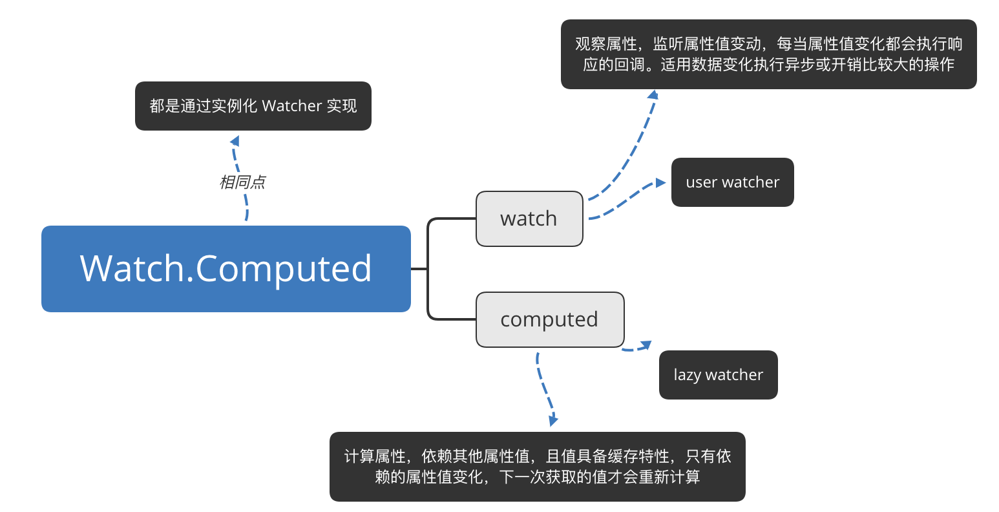
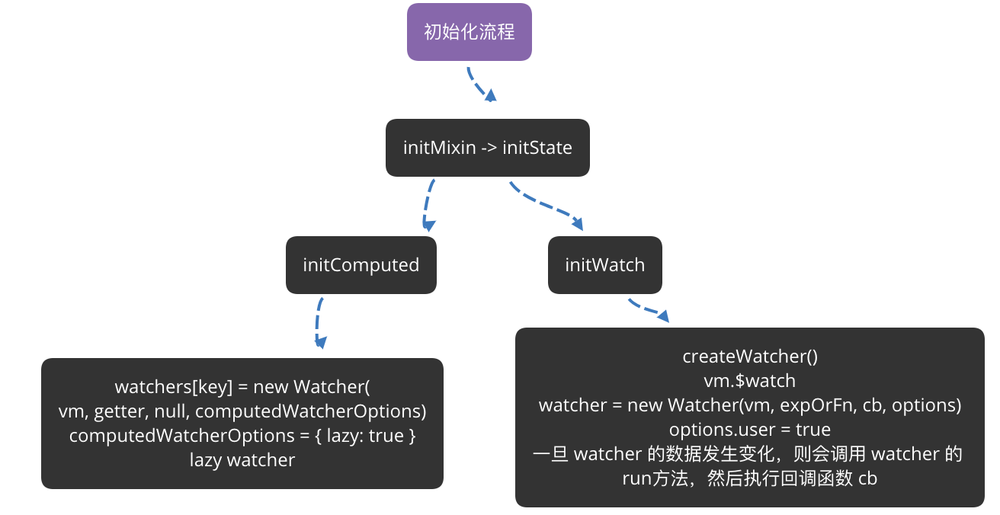

# computed 和 watch

- 都是通过实例化 Watcher 实现

## computed 

- lazy watcher 

- 计算属性，依赖其他属性值，并且值有缓存，避免了每次获取时都要重新计算，  
  只有它依赖的属性值发生变化时，下一次获取 computed 的值才会重新计算

## watch 

- user watcher 
- 观察属性，更多的是观察的作用，类似于某些数据的监听回调，每当监听的数据变化时都会执行回调操作  
  适用异步操作或开销较大的操作

  

