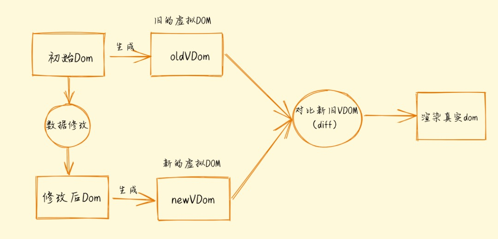

# Diff VDOM

- [链接](https://segmentfault.com/a/1190000008782928)

- [虚拟DOM](https://mp.weixin.qq.com/s/itM1ldWdUHHqdHuv6q_vdw)

* 设置key和不设置key的区别  
  不设key，newCh和oldCh只会进行头尾两端的相互比较，设key后，除了头尾两端的比较外，  
  还会从用key生成的对象oldKeyToIdx中查找匹配的节点，所以为节点设置key可以更高效的利用dom。
* 引入虚拟dom的概念，由于渲染真实的dom比较消耗性能，在改变真实dom之前先比较相应的虚拟dom，如果有改变  
  才去更新对应的真实dom。比较只会在同级进行。
* 有时手动优化dom的效率会比使用虚拟dom高，但是对于页面结构比较大，结构比较复杂的dom时，手动优化会消耗大量的时间  
  且维护性不高。

## 比较方式

* 同级比较
* 循环从两边向中间靠拢

## VDOM 

* [参考](https://mp.weixin.qq.com/s/lAscEOQWkk-IQq6lWCdSSw)

* 对真实DOM的抽象，以js对象（VNode）作为基础的树，用对象的属性来描述节点，  
  最终通过一系列操作使这棵树映射到真实的环境上。
## 为什么需要虚拟DOM

* 操作真实DOM的很慢，设计庞大的元素，容易引起性能问题，频繁操作甚至会导致页面卡顿，影响用户体验。
* 比如一次更新10个DOM节点，真实DOM收到第一个更新DOM请求后会立即执行流程，最终执行10个流程。  
  而虚拟DOM不会立即执行，而是通过VNode将这10次更新的diff内容保存到本地的js对象中，最终将这个js对象  
  一次性attach到DOM上，避免了无谓的操作。

## Diff算法

- [DIff算法看不懂就一起来锤我](https://mp.weixin.qq.com/s/XRR9afpujcjbgFZM0Zw6Gw)