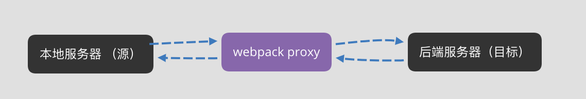

# webpack proxy 工作原理

 - [参考1](https://mp.weixin.qq.com/s/6nQ-m9HL3-FENv6vF4dOnQ)

 - [参考2](https://webpack.docschina.org/configuration/dev-server/#devserverproxy)

 ## 概念

 - webpack 提供的代理服务，基本行为是接收`客户端`发送的请求后转发给其他`服务器`  
   目的是解决在开发模式下的跨域问题（浏览器安全策略）  
   想要实现代理首先需要实现一个中间服务器，webpack中提供服务器的工具是 webpack-dev-server  

```js
module.exports = {
  devServer: {
    port: 8080,
    proxy: {
      '/api': {
        // 如果想将多个特定路径代理到同一目标，则可以使用一个或多个带有 context 属性的对象的数组
        context: ['/auth', '/api'],
        // 对 /api/users 的请求会将请求代理到 http://localhost:3000/api/users
        target: 'http://localhost:3000', // 代理到的目标地址
        // 如果不希望传递/api，可通过 pathRewrite 重写路径
        pathRewrite: {
          '^/api': ''
        },
        // 默认情况下，将不接受在 HTTPS 上运行且证书无效的后端服务器。 如果需要，可以配置 secure: false
        secure: false, 
        // 默认情况下，代理时会保留主机头的来源，可以将 changeOrigin 设置为 true 以覆盖此行为
        changeOrigin: true
      }
    }
  }
}
```

 ## 原理

 - proxy 工作原理实际上是利用 `http-proxy-middleware` 这个代理中间件，实现请求转发给其他服务器

 ```js
const express = require('express');
const proxy = require('http-proxy-middleware');

const app = express();

app.use('/api', proxy({target: 'http://www.example.org', changeOrigin: true}));
app.listen(3000);

// http://localhost:3000/api/foo/bar -> http://www.example.org/api/foo/bar
```

 ## 跨域

- 开发阶段， webpack-dev-server 会启动一个本地开发服务器，所以应用在开发阶段是独立运行在 localhost 的一个端口上  
  而后端服务是运行在另一个地址上，所以由于浏览器同源策略，当本地访问后端服务时会出现跨域。通过设置 webpack proxy 代理后，  
  相当于 浏览器和服务器 中间添加了一个代理者。  



- 当本地发送请求后，代理服务器响应该请求，并将请求转发到目标服务器，目标服务器响应数据后再把数据返回给代理
  服务器，最红再由代理服务器将数据响应给本地。在代理服务器响应给本地浏览器过程中，两者同源，并不会跨域。

> 服务器之间请求数据不会存在跨域行为，跨域行为是浏览器安全策略限制。
