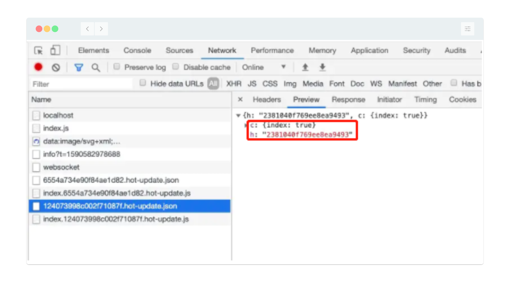

# webpack HMR 热更新

- [参考](https://mp.weixin.qq.com/s/9PfpauvoX97gwtXwvk8Mcg)

## 概念

- Hot Module Replacement 模块热更新，指在应用程序运行中，替换，添加，删除模块，无需重新刷新整个页面  
  只将修改的模块替换到应用中  

## 启用HMR

- webpack-dev-server V4 开始，默认开启HMR

```js
module.exports = {
  devServer: {
    hot: true
  }
}

// plugins 配置方式 
const webpack = require('webpack')
module.exports = {
  devServer: {
    hot: false,
    client: false
  },
  plugins: [
    new webpack.HotModuleReplacementPlugin(),
  ]
}
```

## 实现原理


- Webpack Compiler 将 js 源代码编译成 bundle.js 

- HMR Server 用来将热更新的文件输出给 HMR runtime

- Bundle Server 静态资源文件服务器，提供文件访问路径

- HMR Runtime Socket服务器，会被注入到浏览器，更新文件的变化

- bundle.js 构建输出的文件

- HRM Runtime 和 HMR Server 之间通过 WebSocket 建立联系，用于实时更新变化的文件 

### 上图中分为两个阶段

1. `启动阶段`分为 1 - 2 - A - B 

> 在编写未经过 webpack 编译打包的源代码后，webpack compiler 将源代码和 HMR Runtime 一起编译成 bundle 文件，  
  输出给 Bundle Server 静态资源服务器

2. `更新阶段` 分为 1 - 2 - 3 - 4  

> 当某一个文件 或者 模块 发生变化时，webpack 检测到文件变化会对文件重新编译打包，编译生成唯一的 hash 值，这个 hash 值作为下一次热更新的标识。  
  根据变化的内容生成两个文件，manifest（包含 hash 和 chunkId，用来标识变化的内容）和 chunk.js 模块  
  由于 socket 服务器在 HMR Runtime 和 HMR Server 之间建立了 WebSocket 联系，当文件发生变化时，`服务端`会向浏览器发送一条消息，包含文件  
  改动后生成的 hash 值，作为下一次热更新的标识值。如下图：  



> 浏览器在接收到这条消息之前，已经在上一次的 socket 消息中记住了 hash 值，这时候会创建一个 Ajax 获取服务端此时变化的 manifest 文件，  
  manifest 包含重新编译生成的 hash 值，以及变化的模块，浏览器根据 manifest 文件获取模块变化的内容，从而触发 render 流程，实现局部更新。

## 总结

- 通过 webpack-dev-server 创建两个服务器，提供静态资源的 `HMR Server` 和 Socket （HMR Runtime）

- `HMR Server` 负责提供静态资源的服务（打包后的资源被浏览器直接请求和解析）

- `HMR Runtime` 是一个 WebSocket 长连接，负责通信

- 当 `HMR Runtime` 监听到对应模块发送变化时，会生成两个文件 .json(manifest) 和 .js (update chunk)

- 通过 WebSocket ，HMR Runtime 会主动将这两个文件发送到浏览器

- 浏览器拿到这两个文件后，依赖 HMR Runtime 机制，触发 render 流程，针对修改的模块更新