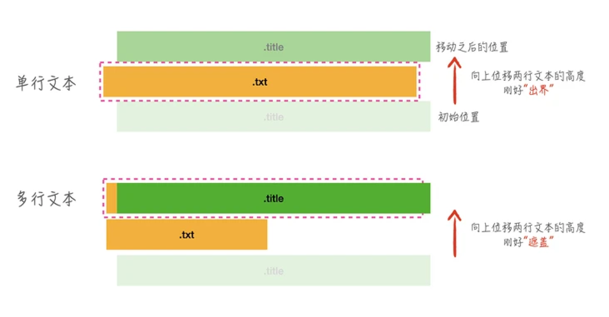

# 文本溢出显示效果

- [文本超出效果](https://mp.weixin.qq.com/s/PAATe9LNy9Ay7cwe8MG-9A)

## 文本超出时显示 title  未超出不显示 （单行）

- 原理示意如下图：



```html
<div class="box">
  <p class="txt">很多 Node.js 应用会使用 NODE_ENV 来区分运行环境，但 EGG_SERVER_ENV 区分得更加精细。一般的项目开发流程包括本地开发环境、测试环境、生产环境等，除了本地开发环境和测试环境外</p>
  <p class="title" title="很多 Node.js 应用会使用 NODE_ENV 来区分运行环境，但 EGG_SERVER_ENV 区分得更加精细。一般的项目开发流程包括本地开发环境、测试环境、生产环境等，除了本地开发环境和测试环境外">很多 Node.js 应用会使用 NODE_ENV 来区分运行环境，但 EGG_SERVER_ENV 区分得更加精细。一般的项目开发流程包括本地开发环境、测试环境、生产环境等，除了本地开发环境和测试环境外</p>
</div>
```

```css
.box {
  /* 父容器一行的高度 超出 hidden */
  line-height: 22px;
  height: 22px;
  overflow: hidden;
}

.txt {
  /* 两行的高度 */
  max-height: 44px;
}

.title {
  background: rebeccapurple;
  /* 相对定位 */
  position: relative;
  /* top 两行的高度 */
  top: -44px;
  overflow: hidden;
  text-overflow: ellipsis;
  white-space: nowrap;
}

p {
  margin: 0;
}
```

## 文本超出 前置省略号 

```html 
<div class="box2">
  Lorem ipsum, dolor sit amet consectetur adipisicing elit. Odit illum praesentium illo, quis accusantium nostrum, debitis numquam sapiente esse pariatur doloremque provident odio repellendus ea in! Aspernatur repellat hic vitae.
</div>
```

```css
.box2 {
  overflow: hidden;
  text-overflow: ellipsis;
  white-space: nowrap;
  /* 改变排版方向 默认从左到右 */
  direction: rtl;
}
```

## 中间省略效果

- 借助 ::before 

```html
<div class="box">
  <p class="txt">很多 Node.js 应用会使用 NODE_ENV 来区分运行环境，但 EGG_SERVER_ENV 区分得更加精细。一般的项目开发流程包括本地开发环境、测试环境、生产环境等，除了本地开发环境和测试环境外</p>
  <p class="title3" title="很多 Node.js 应用会使用 NODE_ENV 来区分运行环境，但 EGG_SERVER_ENV 区分得更加精细。一般的项目开发流程包括本地开发环境、测试环境、生产环境等，除了本地开发环境和测试环境外">很多 Node.js 应用会使用 NODE_ENV 来区分运行环境，但 EGG_SERVER_ENV 区分得更加精细。一般的项目开发流程包括本地开发环境、测试环境、生产环境等，除了本地开发环境和测试环境外</p>
</div>
```

```css
.title3 {
  background: rebeccapurple;
  /* 相对定位 */
  position: relative;
  /* top 两行的高度 */
  top: -44px;
  /* 关键需要设置 height 为一行的高度 */
  height: 22px;
  overflow: hidden;
  text-align: justify;
}

.title3::before {
  content: attr(title);
  float: right;
  width: 50%;
  overflow: hidden;
  text-overflow: ellipsis;
  white-space: nowrap;
  direction: rtl;
}
```